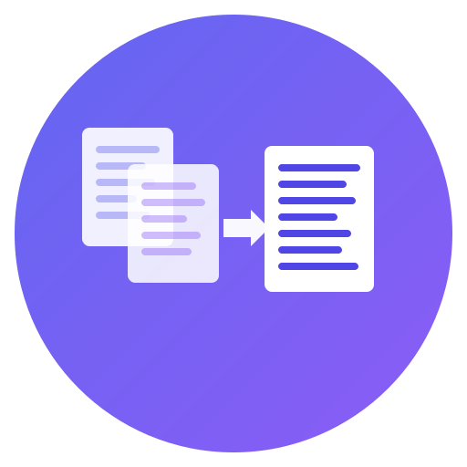

# repo-roller

<p align="center">
  
</p>

<p align="center">
  <a href="https://www.npmjs.com/package/repo-roller"></a>
  <a href="https://github.com/maikeleckelboom/repo-roller/blob/main/LICENSE"></a>
  <a href="https://github.com/maikeleckelboom/repo-roller/actions"></a>
</p>

<p align="center">
  A CLI tool that aggregates source code files into a single output file, with token counting and cost estimation for LLMs.
</p>

## Why repo-roller?

Large Language Models have limited context windows. When you need to share your codebase with an LLM, you face a frustrating workflow:

- **Copy-paste dance** - Manually copying files one by one is slow and error-prone
- **Token black box** - You have no idea how many tokens you're using until you hit the limit
- **All-or-nothing** - Either you share too much and exceed context limits, or too little and lose important context

repo-roller solves this by scanning your project, respecting `.gitignore`, filtering files by your criteria, and compiling everything into a single LLM-ready file. You get token estimates and cost breakdowns upfront, so you know exactly what you're working with.

## What it does

repo-roller scans a directory, respects `.gitignore`, filters files by your criteria, and dumps everything into one file (Markdown, JSON, YAML, or plain text). It also estimates token counts and shows cost estimates for various LLM providers.

## Installation

```bash
npm install -g repo-roller
# or use directly
npx repo-roller .
```

## Basic usage

```bash
# Dump current directory to markdown
repo-roller .

# Only TypeScript files, no tests
repo-roller . --lang typescript --no-tests

# Preview what would be included
repo-roller . --dry-run

# Interactive file picker
repo-roller . --interactive

# See token count and cost estimates
repo-roller . --target claude-sonnet

# Copy output to clipboard (paste directly into LLM)
repo-roller . --copy
```

## Output formats

- **Markdown** (default) - Code blocks with syntax highlighting, file tree, basic stats
- **JSON** - Structured data with metadata
- **YAML** - Same as JSON but in YAML
- **Plain text** - Just the files with separators

### Example outputs

**Markdown format** (default):
```markdown
# Source Code Bundle

## Directory Structure
├── src/
│   ├── index.ts
│   └── utils.ts
└── package.json

## Files

### src/index.ts
\`\`\`typescript
export function main() {
  console.log("Hello, world!");
}
\`\`\`

### src/utils.ts
\`\`\`typescript
export const add = (a: number, b: number) => a + b;
\`\`\`
```

**JSON format** (`--format json`):
```json
{
  "metadata": {
    "generatedAt": "2024-01-15T10:30:00Z",
    "totalFiles": 2,
    "totalTokens": 150,
    "totalBytes": 1250
  },
  "files": [
    {
      "path": "src/index.ts",
      "content": "export function main() {\n  console.log(\"Hello, world!\");\n}",
      "tokens": 85,
      "bytes": 680
    }
  ]
}
```

**Plain text format** (`--format txt`):
```
=== src/index.ts ===
export function main() {
  console.log("Hello, world!");
}

=== src/utils.ts ===
export const add = (a: number, b: number) => a + b;
```

## Filtering options

```bash
--ext ts,tsx           # Only these extensions
--lang typescript      # Language shortcut
--max-size 100         # Max file size in KB
--no-tests             # Exclude test files
--no-deps              # Exclude node_modules, vendor, etc.
--no-generated         # Exclude build/dist directories
--strip-comments       # Remove comments (basic regex, not perfect)
```

## Token estimation

The tool estimates tokens using a heuristic (roughly 4 characters per token with adjustments). It's not using actual tokenizers, but aims for ~95% accuracy on larger codebases. Take the numbers as estimates, not exact counts.

```bash
repo-roller . --target claude-sonnet
# Shows: estimated tokens, cost per provider, context window utilization
```

## Presets

Built-in presets for common scenarios:

- `ts` - TypeScript files
- `js` - JavaScript files
- `python` - Python files
- `go` - Go files
- `rust` - Rust files
- `docs` - Documentation (md, txt)
- `llm` - Common code files with 2MB size limit
- `minimal` - Stripped comments, smaller files
- `full` - Everything

```bash
repo-roller . --preset minimal
```

## Configuration

You can create config files in your project:

**`.reporoller.yml`** - Define profiles for file ordering:

```yaml
architectural_overview: |
  Brief description of your project structure.

profiles:
  core-first:
    layout:
      - package.json
      - src/core/**/*.ts
      - src/**/*.ts
```

**`repo-roller.config.mjs`** - Define custom presets:

```javascript
export default {
  presets: {
    mypreset: {
      extensions: ['ts', 'tsx'],
      exclude: ['**/*.test.ts'],
      stripComments: true,
    },
  },
};
```

Initialize configs interactively:

```bash
repo-roller init
```

## Supported LLM providers

For cost estimates (input costs only):

| Provider | Context Window | Cost per 1M tokens |
|----------|---------------|-------------------|
| Claude 3.5 Sonnet | 200K | $3.00 |
| Claude 3 Opus | 200K | $15.00 |
| Claude 3.5 Haiku | 200K | $0.80 |
| GPT-4o | 128K | $2.50 |
| GPT-4 Turbo | 128K | $10.00 |
| GPT-4 | 8K | $30.00 |
| OpenAI o1 | 200K | $15.00 |
| Gemini 1.5 Pro | 2M | $1.25 |

```bash
repo-roller --list-providers
```

## More options

```bash
repo-roller --help           # Full list of options
repo-roller --examples       # Usage examples
repo-roller . --validate     # Check config files for errors
repo-roller . --stats-only   # Just show statistics
repo-roller . --tree         # Include directory tree in output
```

## Limitations

- Token estimation is heuristic-based, not exact
- Comment stripping uses basic regex (may not handle all edge cases)
- No incremental updates - rescans everything each time
- Binary file detection samples first 8KB (may occasionally misclassify)

## License

MIT
